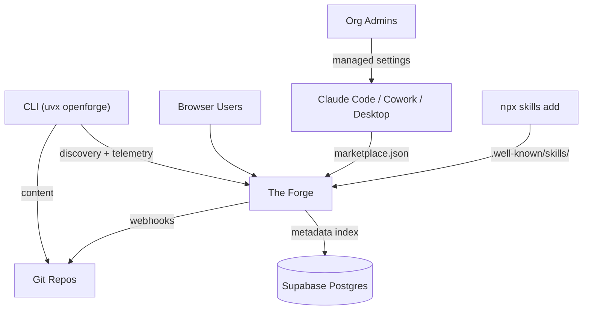
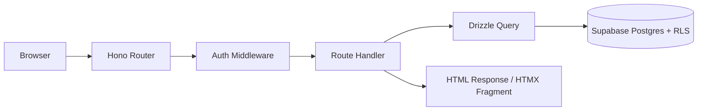
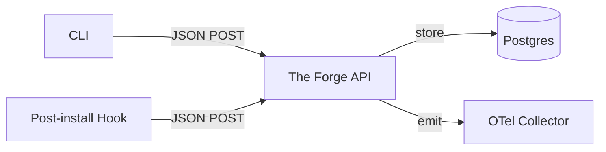
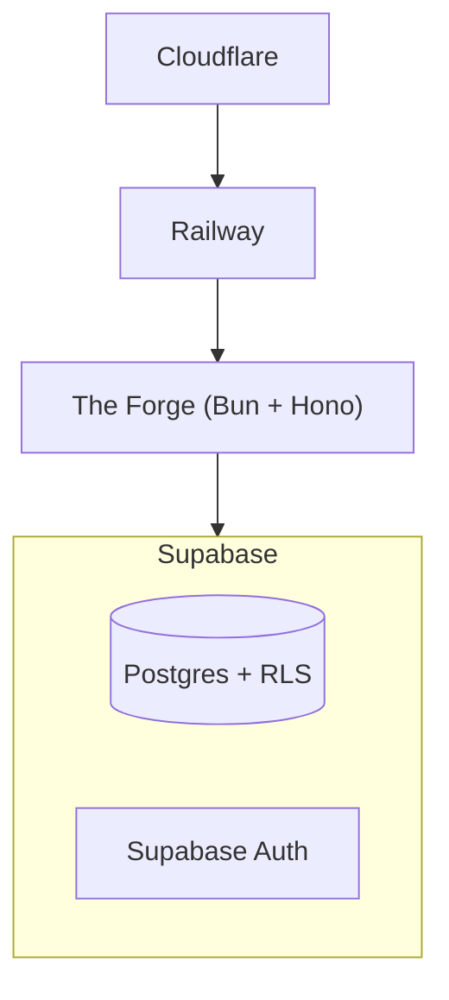

# OpenForge — Architecture Design

## Overview

OpenForge is an open-source platform for distributing, discovering, and curating AI agent plugins and skills. It has two components:

- **The Forge** — a web app for browsing, searching, voting, discussing, and curating plugins. Serves `marketplace.json` for native Claude Code/Cowork integration and `.well-known/skills/index.json` for skills.sh compatibility.
- **The CLI** (`uvx openforge`) — a Python tool for installing plugins and skills across multiple AI agents from a single canonical format. Drop-in compatible with skills.sh file layout.

The canonical plugin format is Claude Code's `.claude-plugin/` structure. Plugins are a superset of skills — a plugin contains skills plus commands, hooks, MCP config, and agent definitions. The CLI installs skills from plugins to all detected agents universally, and installs richer plugin components (MCP, commands, hooks) to agents that support them.

## Access Patterns



Four access patterns:

1. **CLI users** — install/search plugins via `uvx openforge`, content fetched from git, metadata from Forge API
2. **Forge users** — browse, vote, discuss, submit plugins via web UI
3. **Native Claude Code/Cowork/Desktop users** — discover and install plugins via `marketplace.json` served by the Forge
4. **Managed deployment** — org admins push plugins to all users via managed settings (`extraKnownMarketplaces` in org-level `.claude/settings.json`)
5. **skills.sh compatibility** — `npx skills add` can discover and install from the Forge via the `.well-known/skills/index.json` endpoint

## Data Flow

### Indexing (git → Postgres)

1. Admin registers a git repo in the Forge
2. Webhook fires on push
3. Forge scans for `.claude-plugin/plugin.json`, `marketplace.json`, and `SKILL.md` files
4. Extracts metadata into Postgres
5. Regenerates the `marketplace.json` and `.well-known/skills/index.json` endpoints

### Install via CLI

1. CLI queries Forge API for plugin metadata + git coordinates
2. CLI clones content from git into `.agents/plugins/<name>/` (or `.agents/skills/<name>/` for standalone skills)
3. Detects installed agents, installs skills to all via symlink (copy as fallback)
4. For agents with richer support: also installs MCP config, translates commands, sets up hooks
5. Records install in `.openforge-lock.json`
6. Fires telemetry event (fire-and-forget)

### Install via Claude Code native

1. Org admin or user adds marketplace URL
2. Claude Code fetches `marketplace.json` from the Forge
3. User browses/installs natively
4. Post-install hook pings the Forge for telemetry

### Install via skills.sh

- The Forge serves `.well-known/skills/index.json` — `npx skills add` can discover and install directly without the OpenForge CLI

### Community (Forge only)

- Votes, comments, submissions — all Forge ↔ Postgres, no git involvement

## The Forge (Web App)

Server-rendered web app — no SPA, no client-side framework.

**Request flow:**



### Endpoints

| Route | Purpose | Auth |
|-------|---------|:----:|
| `GET /` | Browse/search catalogue | Mode-dependent |
| `GET /plugins/:name` | Plugin detail page | Mode-dependent |
| `POST /plugins/:name/vote` | Upvote/downvote | Yes |
| `POST /plugins/:name/comments` | Add comment | Yes |
| `GET /submit` | Upload form | Yes |
| `POST /submit` | Process ZIP upload | Yes |
| `GET /admin` | Registry/user management | Admin only |
| `GET /api/marketplace.json` | Claude Code marketplace feed | Mode-dependent |
| `GET /.well-known/skills/index.json` | skills.sh compatible index | Mode-dependent |
| `POST /api/telemetry` | CLI install events | No |
| `POST /api/telemetry/activate` | Post-install hook pings | No |
| `POST /api/webhooks/github` | Git push webhook receiver | Webhook secret |

### Deployment modes

A single config toggle controls access:

- **Private mode** (`OPENFORGE_MODE=private`) — all routes require auth. For company deployments. Allowed email domains restrict registration. API endpoints require auth tokens.
- **Public mode** (`OPENFORGE_MODE=public`) — browse and API endpoints are public. Auth required only for write actions (vote, comment, submit). Open registration.

### Auth model

- Supabase Auth handles sign-up/sign-in (email + magic link + optional OAuth)
- JWT expiration max 7 days + refresh token rotation
- MFA support enabled
- Middleware validates session, passes JWT to Supabase client for RLS enforcement
- Allowed email domains table restricts registration in private mode

## CLI Architecture

Three layers:

### 1. Commands layer

Typer commands handling user interaction, argument parsing, output formatting via Rich.

Core commands: `install`, `find`, `list`, `remove`, `check`, `update`, `init`, `config`.

### 2. Providers layer

Resolve where plugin/skill content comes from:

| Provider | Resolves | Example input |
|----------|----------|---------------|
| `github` | GitHub repos | `owner/repo`, `owner/repo@skill` |
| `registry` | Forge API | `plugin-name`, `--registry anthropic-official` |
| `wellknown` | Well-known URLs | `https://example.com/.well-known/skills/` |

Source parsing follows the same syntax as skills.sh for compatibility.

### 3. Agents layer

Data-driven agent registry supporting all 51 agents from skills.sh:

```python
@dataclass(frozen=True)
class AgentConfig:
    name: str
    display_name: str
    skills_dir: str
    global_skills_dir: str | None
    detect: Callable[[], bool]
    capabilities: frozenset[str] = frozenset({"skills"})
    show_in_list: bool = True
```

Capabilities determine what gets installed per agent:

| Capability | What it installs |
|-----------|-----------------|
| `skills` | Symlink SKILL.md files (all 51 agents) |
| `mcp` | Generate agent-specific MCP config |
| `commands` | Translate slash commands to agent format |
| `hooks` | Install lifecycle hooks |
| `agents` | Install subagent definitions |
| `env` | Native env.json handling |

Phase 1: all agents get `skills`. Claude Code gets all capabilities. Cursor gets `skills` + `mcp` + `commands`. Adding capabilities to other agents is a one-line config change.

### Plugin install flow

1. Parse source → resolve via provider → get metadata + git coordinates
2. Fetch content to `.agents/plugins/<name>/` (plugins) or `.agents/skills/<name>/` (standalone skills)
3. For every detected agent: symlink skills from the plugin to the agent's skills dir
4. For agents with richer capabilities: install MCP config, translate commands, set up hooks
5. Write to `.openforge-lock.json`
6. Fire telemetry (fire-and-forget)
7. Print summary

### Configuration

Precedence (highest to lowest):

1. Environment variables
2. `.openforge.toml` (project-level, checked into repo)
3. `~/.config/openforge/config.toml` (user-level, MDM-pushable)
4. Defaults (public Forge at `openforge.gitguardian.com`)

```toml
# .openforge.toml or ~/.config/openforge/config.toml
[forge]
url = "https://forge.acme.com"

[telemetry]
enabled = true
```

### Lock file

`.openforge-lock.json` — our own format with richer metadata than skills.sh (plugin membership, forge source, agent adaptations). Compatible file layout on disk (`.agents/skills/`, `.agents/plugins/`) so skills installed by either tool are visible to agents.

## Telemetry

### Collection



- CLI and hooks send simple JSON POST to the Forge
- The Forge stores events in Postgres AND emits OTel spans/events server-side
- Companies can route OTel to their own collector (Datadog, Grafana, etc.)

### Privacy

| Field | Anonymous (public) | Authenticated (company) |
|-------|:------------------:|:----------------------:|
| Plugin name, version | Yes | Yes |
| Source registry | Yes | Yes |
| Agents installed for | Yes | Yes |
| CLI version | Yes | Yes |
| CI detected | Yes | Yes |
| User email/ID | No | Yes |
| Org context | No | Yes |

- `DO_NOT_TRACK=1` disables all telemetry
- Auto-disabled in CI
- Skip telemetry for private repos
- No PII in anonymous telemetry

### Default endpoint

- Default: `openforge.gitguardian.com/api/telemetry` (internal GG instance)
- Overridden via `.openforge.toml` or `~/.config/openforge/config.toml`

## Security

### Auth & Sessions
- Supabase Auth — no custom auth implementation
- JWT max 7 days + refresh token rotation
- MFA enabled
- Allowed email domains for registration (private mode)

### Database
- Row Level Security on every table from day one
- All queries via Drizzle (parameterized, never raw SQL)
- Server-side permission enforcement via RLS, not just application layer

### API
- Rate limiting on all endpoints from day one (100 req/hour per IP baseline)
- Stricter limits on auth routes (3 per email/hour for password reset / magic link)
- CORS locked to production domain only — never wildcard
- Validate redirect URLs against allowlist
- Webhook signature verification before processing

### Headers & Transport
- HTTPS enforced (Railway TLS termination, Cloudflare in front)
- Secure / HttpOnly / SameSite cookies
- Security headers via Hono `secureHeaders` middleware: CSP, HSTS, X-Content-Type-Options, X-Frame-Options

### Input & Uploads
- ZIP upload size limit + file type validation by magic bytes, not extension
- All user input sanitized — plugin names, comments, search queries
- Path traversal prevention on skill/plugin names (reject `/`, `\`, `..`)
- Prompt injection scanning on submitted plugin content

### Secrets & Dependencies
- All secrets via env vars, never in code
- ggshield in CI for secret scanning
- Dependency scanning in CI

### Storage
- Supabase storage buckets locked down — users only access their own uploads

### Logging & Audit
- Log critical actions: submissions, approvals/rejections, role changes, deletions
- Structured logging in production (no console.log)

### Data & Privacy
- Account deletion flow from day one (GDPR)
- Telemetry opt-out via `DO_NOT_TRACK=1`
- Separate test and production Supabase projects
- Test webhooks never touch real systems

### Backups
- Supabase automated daily backups + point-in-time recovery

### Future (tracked in Linear)
- Penetration testing with internal security tools
- Secret rotation automation

## Hosting & Infrastructure

**Assumption for v1:** The Forge runs on Supabase + Railway. Other providers possible later.



## Key Decisions

| Decision | Choice | Rationale |
|----------|--------|-----------|
| Plugin format | Claude Code `.claude-plugin/` | Industry standard, richest format |
| Git as source of truth | Content in git, metadata in Postgres | Devs use git; no vendor lock-in for content |
| Agent support | All 51 from skills.sh, data-driven config | Drop-in compatible, trivially extensible |
| CLI language | Python + Typer | Team expertise, `uvx` distribution |
| Web framework | Hono + HTMX | Server-rendered, no SPA complexity |
| Web app name | The Forge | Short, matches brand |
| Auth | Supabase Auth | Built-in email/magic link/OAuth, managed |
| Database security | RLS from day one | Defence in depth, not just app-layer checks |
| Hosting | Supabase + Railway + Cloudflare | Managed, simple, good DX |
| Telemetry | JSON POST to Forge, Forge emits OTel server-side | CLI stays simple, companies get OTel |
| Config | env > `.openforge.toml` > `~/.config/openforge/config.toml` > defaults | MDM-friendly, team-shareable |
| Lock file | `.openforge-lock.json`, compatible layout with skills.sh | Own lock format, shared disk layout |
| Deployment modes | Public / Private via config toggle | Single codebase for both |
| First deployment | `openforge.gitguardian.com` (private/internal) | Public domain TBD |
